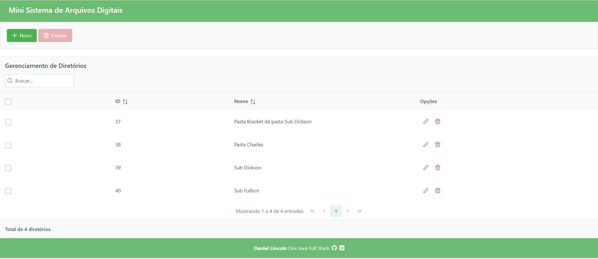
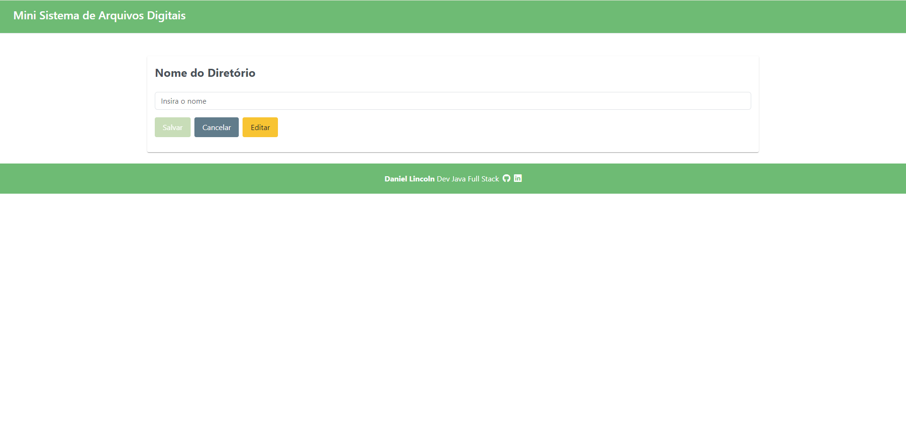
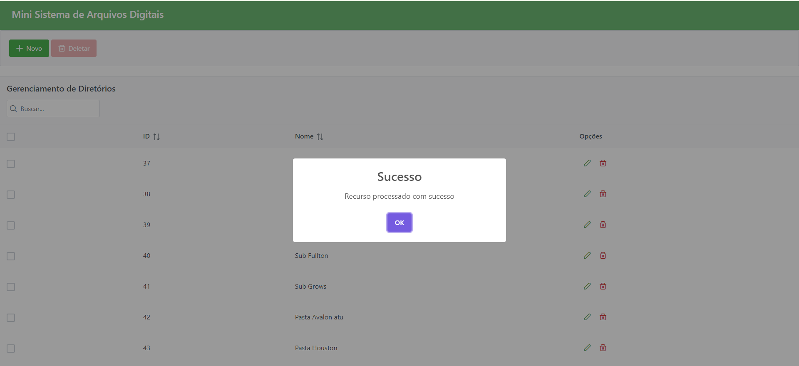
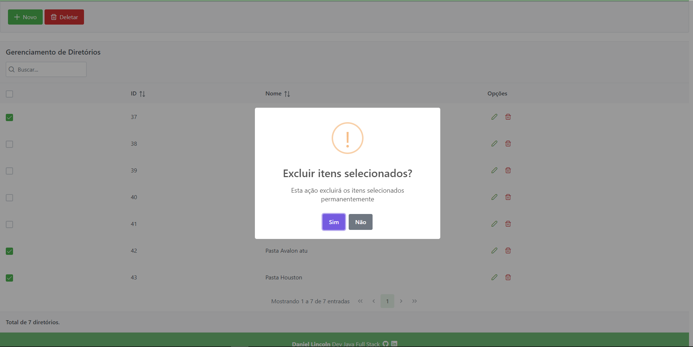
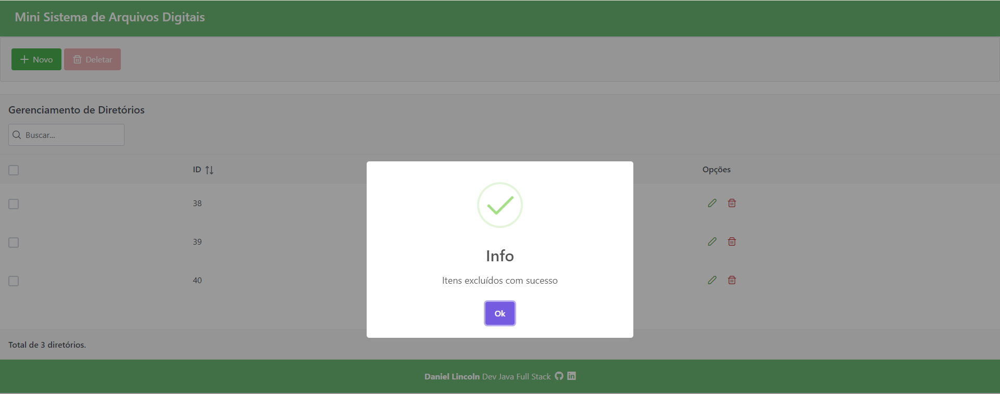

# Mini Sistema de Arquivos Virtuais - Frontend

Este repositório contém a implementação do frontend para um mini sistema de arquivos virtuais. O frontend foi desenvolvido usando Angular e se comunica com o backend via API REST.

- **Angular**: Framework para desenvolvimento de aplicações web.
- **Angular CLI**: Ferramenta de linha de comando para Angular.
- **RxJS**: Biblioteca para programação reativa.
- **Bootstrap**: Framework de CSS para design responsivo.
- **PrimeNG**: Conjunto de interface de usuário.

## Requisitos

- Node.js (versão 14 ou superior)
- Angular CLI

## Configuração do Projeto

1. **Clone o repositório:**
    ```bash
    git clone https://github.com/danicoln/arq-virtuais-ui.git
    cd arq-virtuais-ui
    ```

2. **Instale as dependências:**
    ```bash
    npm install
    ```

3. **Configure o ambiente:**

    Crie um arquivo `.env` na raiz do projeto com a configuração do endpoint da API:

    ```env
    API_URL=http://localhost:8080/api
    ```

4. **Execute a aplicação:**
    ```bash
    ng serve
    ```

    A aplicação será iniciada na porta padrão `4200`. 

5. **Testes:**

    Para executar os testes, use o seguinte comando:

    ```bash
    ng test
    ```

6. **Evidências:**

    **Listagem de Diretórios**

    

    **Cadastro de Diretórios**

    

    **Mensagem de Sucesso**

    

    **Exclusão em Lote**

    

    **Mensagem de Sucesso Exclusão em Lote**

    

## Documentação

O projeto usa o Angular CLI e a documentação pode ser acessada no [Angular Docs](https://angular.io/docs).
